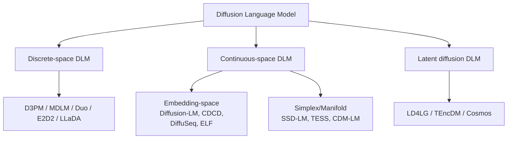

# Diffusion Language Model (DLM)

## 一句话定义

用扩散 / 流匹配范式做文本生成的非自回归语言模型。和 AR LM 相比，DLM 通过迭代去噪一次性给出整段序列，理论上可并行、可后悔（remasking / refinement）。

## 三大分支

### 1. 离散空间 DLM

- 直接在 token 空间上做扩散。代表：D3PM（Austin 2021）、MDLM（Sahoo 2024）、Duo（Sahoo 2025）、E2D2（Arriola 2025）。
- 通常用 `[MASK]` 吸收态或均匀分类转移核。
- 目前**经验性能最强**，但与图像扩散技术栈断裂（[[Classifier-Free-Guidance]] 在离散空间上效果有限）。

### 2. 连续空间 DLM

- 把 token 映到 embedding / simplex / manifold 上做扩散。代表：Diffusion-LM（Li 2022）、CDCD（Dieleman 2022）、DiffuSeq（Gong 2023）、SSD-LM（Han 2023）、TESS（Mahabadi 2024）、[[ELF]]（Hu 2026）。
- 通常每步还要加一个 token-level cross-entropy / rounding loss / simplex 约束，把轨迹钉回离散空间——[[ELF]] 的论点是这层钉过度限制了 flow 表达力。

### 3. Latent diffusion DLM

- 先用 autoencoder 压到低维 latent，再在 latent 上扩散，最后用独立 decoder 解回 token。代表：LD4LG（Lovelace 2023）、TEncDM（Shabalin 2025）、Cosmos（Meshchaninov 2025）。
- 多一个解码阶段，但 latent 更紧凑。

## 评测协议

- **无条件生成**：常用 OpenWebText (OWT)；指标 Gen-PPL（用更大的 LM 评得到的 perplexity）+ unigram entropy 度量多样性。
- **条件生成**：WMT14 De→En（BLEU）、XSum（ROUGE-1/2/L）。
- **采样效率**：报告 sampling steps；很多近期工作还要再做一次 distillation 来跑 few-step 生成（如 MDLM+SDTT、Duo+DCD、FMLM）。

## 当前研究态势（截至 2026 Q2）

- 离散 DLM 仍是 SOTA 主线，但增长靠 remasking、adaptive inference、self-distillation。
- 连续 DLM 经 [[ELF]] / FLM / LangFlow 的"flow matching + 干净接口"重新对齐后，已经能在同等甚至更少训练量下追平 / 超越离散 DLM。
- 与多模态融合的方向（Omni-Diffusion、Diffucoder）逐步起来。

## 关键综述与里程碑

- Li et al., *A survey on diffusion language models*, arXiv:2508.10875, 2025
- Austin et al., *D3PM: Structured denoising diffusion in discrete state-spaces*, NeurIPS 2021
- Li et al., *Diffusion-LM*, NeurIPS 2022
- Sahoo et al., *MDLM: Simple and effective masked diffusion LMs*, NeurIPS 2024
- Sahoo et al., *Duo: Diffusion duality*, ICML 2025
- Hu et al., *ELF: Embedded Language Flows*, arXiv:2605.10938, 2026
